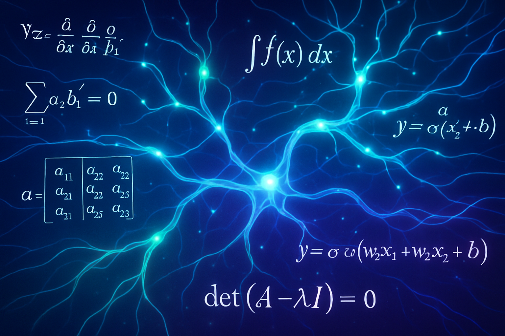

# 🎓 AI Math Roadmap Website

A comprehensive, interactive educational platform designed to guide learners through the essential mathematics needed for Artificial Intelligence and Machine Learning.



## 📚 Overview

This project provides a structured learning path for mastering mathematics in the context of AI/ML. The website features multiple educational modules covering fundamental to advanced mathematical concepts essential for understanding artificial intelligence.

## 🎯 Educational Modules

### Core Mathematics
- **📈 Algebra Module** - Fundamental algebraic concepts and operations
- **📊 Calculus Module** - Differential and integral calculus for ML
- **🔢 Linear Algebra Module** - Vector spaces, matrices, and transformations
- **📉 Statistics & Probability Module** - Statistical foundations for data science
- **📋 Information Theory Module** - Information theory and entropy concepts

### Advanced Topics
- **🔧 KCL Protocol** - Specialized protocol implementations

## 🚀 Features

- **Modern React Architecture** - Built with React 19.1.0
- **Responsive Design** - Optimized for all device sizes
- **Interactive Learning Modules** - Engaging educational content
- **Progressive Web App** - Fast loading and offline capabilities
- **Modern UI/UX** - Clean, professional design with Tailwind CSS

## 🛠️ Technology Stack

- **Frontend:** React 19.1.0, Modern JavaScript (ES6+)
- **Styling:** Tailwind CSS v4.1.7 with custom design system
- **Build Tool:** Vite (evident from build structure)
- **Deployment:** Static site ready for any hosting platform

## 📁 Project Structure

```
├── dist/                     # Production build
│   ├── assets/              # Optimized assets
│   │   ├── *.png           # Module images and hero image
│   │   ├── index.js        # Bundled React application (~150 lines minified)
│   │   └── index.css       # Compiled Tailwind styles
│   ├── index.html          # Main entry point
│   └── favicon.ico         # Site favicon
├── README.md               # Project documentation
└── .gitignore             # Git ignore rules
```

## 🎨 Design Features

### Advanced Styling System
- **OKLCH Color Space** - Modern color management
- **Custom CSS Properties** - Flexible theming system
- **Animation Framework** - Smooth transitions and interactions
- **Responsive Grid System** - Mobile-first design approach
- **Dark/Light Mode Support** - Adaptive theming

### UI Components
- Modern card-based layouts
- Interactive navigation systems
- Comprehensive form components
- Modal and overlay systems
- Progress indicators and loading states

## 🚀 Quick Start

### Prerequisites
- Any modern web browser
- Web server (for local development)

### Installation

1. **Clone the repository**
   ```bash
   git clone https://github.com/AdnanAhmad1994/ai-math-roadmap-website.git
   cd ai-math-roadmap-website
   ```

2. **Serve the application**
   ```bash
   # Using Python
   python -m http.server 8000
   
   # Using Node.js
   npx serve dist
   
   # Using any other static server
   ```

3. **Open in browser**
   Navigate to `http://localhost:8000`

## 📚 Educational Content

### Learning Path
1. **Foundation Level** - Algebra and basic calculus concepts
2. **Intermediate Level** - Linear algebra and statistics
3. **Advanced Level** - Information theory and specialized protocols
4. **Application Level** - Real-world AI/ML mathematical applications

### Target Audience
- 🎓 Students beginning their AI/ML journey
- 💼 Professionals transitioning to AI roles
- 👨‍🏫 Educators teaching AI fundamentals
- 🔬 Researchers seeking mathematical foundations

## 🌟 Performance Features

- **Optimized Bundle Size** - Efficient code splitting
- **Fast Loading** - Optimized assets and caching
- **SEO Friendly** - Proper meta tags and structure
- **Accessibility** - WCAG compliant design
- **Cross-browser Compatibility** - Modern browser support

## 🤝 Contributing

We welcome contributions to improve the AI Math Roadmap! Here's how you can help:

1. **Fork the repository**
2. **Create a feature branch** (`git checkout -b feature/amazing-feature`)
3. **Commit your changes** (`git commit -m 'Add amazing feature'`)
4. **Push to the branch** (`git push origin feature/amazing-feature`)
5. **Open a Pull Request**

### Development Guidelines
- Follow React best practices
- Maintain responsive design principles
- Ensure accessibility standards
- Write clear, educational content
- Test across different browsers

## 📄 License

This project is licensed under the MIT License - see the [LICENSE](LICENSE) file for details.

## 🙏 Acknowledgments

- Built with modern web technologies for optimal performance
- Designed with accessibility and user experience in mind
- Educational content structured for progressive learning
- Community-driven development approach

## 📞 Contact

**Adnan Ahmad** - [@AdnanAhmad1994](https://github.com/AdnanAhmad1994)

Project Link: [https://github.com/AdnanAhmad1994/ai-math-roadmap-website](https://github.com/AdnanAhmad1994/ai-math-roadmap-website)

---

⭐ **Star this repository if you find it helpful for your AI/ML learning journey!**
